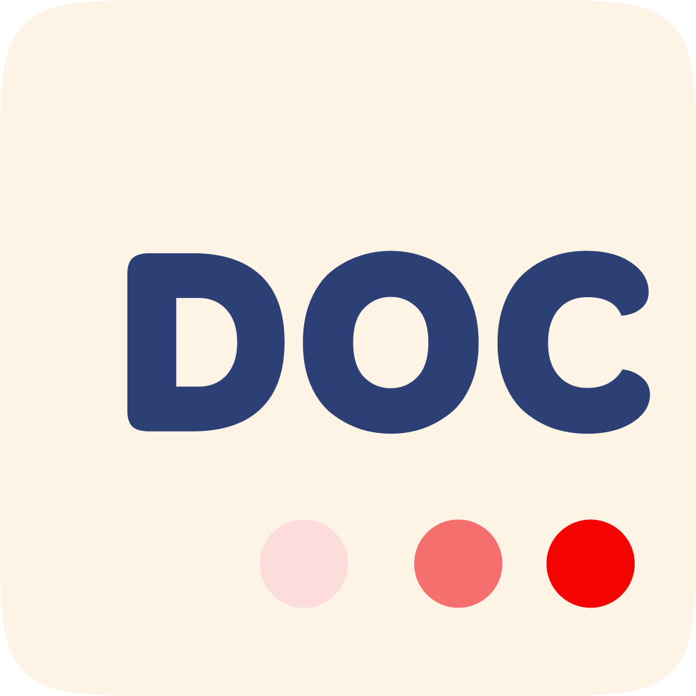
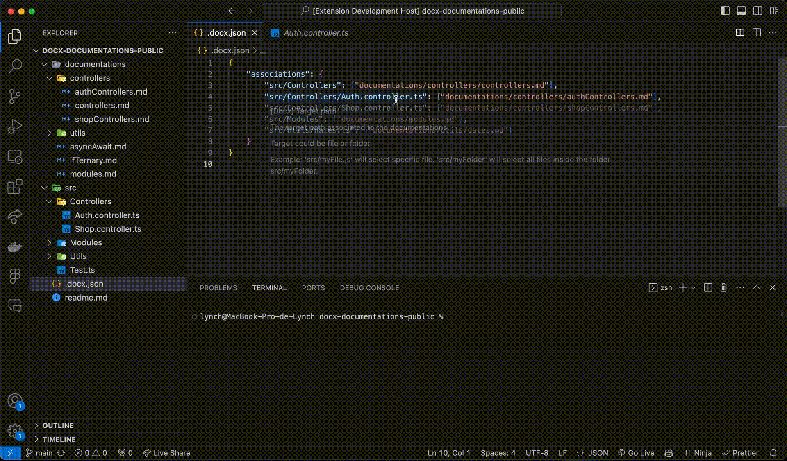
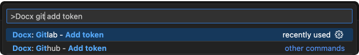
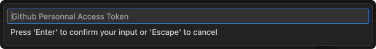
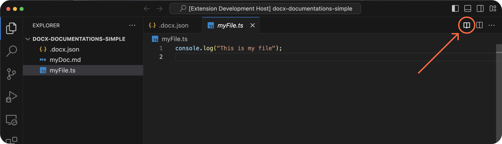
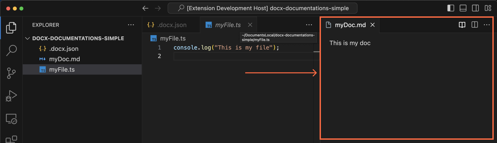

<p align="center">
  
</p>
<h1 align="center">DOCX</h1>
<p align="center">Visual Studio Code extension that facilitate access to your company's standards and documentation for the technical team</p>

<div align="center">
  <a href="https://marketplace.visualstudio.com/items?itemName=docx-mt5.docx">
    
  </a>
</div>

<br />

<p align="center">
  <a href="#demo">Demo</a> •
  <a href="#installation">Installation</a> •
  <a href="#configuration">Configuration</a> •
  <a href="#usage">Usage</a> •
  <a href="#features">Features</a> •
  <a href="#roadmap">Roadmap</a> •
  <a href="#contribution">Contribution</a> •
  <a href="#other">Other</a>
</p>

<hr />
<br />

## Demo



## Installation

1. Visit the extension's page on the [Visual Studio Code Marketplace](https://marketplace.visualstudio.com/items?itemName=docx-mt5.docx).
2. Click "Install" for the extension.

## Configuration

To configure the extension, follow these steps:

1. Open a project in Visual Studio Code.
2. Use the following command to create a `.docx.json` file at the root of the project. <br />
   This command will generate a configuration file with all files and folders associations possible based on the project.

   ```bash
   docx generate-config
   ```

3. When you have finished the associations between files/folders and the documentations, you can type the following command to remove all unused associations :

   ```bash
   docx clean-config
   ```

<br />

The `.docx.json` file follows this structure:

```json
{
  "associations": {
    "file/or/folder": ["path/to/documentation.md"],
    "file/or/folder/2": [
        "path/to/documentation.bpmn"
        "github/or/gitlab/url/to/documentation.md",
    ]
  }
}
```

<br />

### Configuring Associations with local documentations

Here's an example of `.docx.json`:

```json
{
  "associations": {
    "myFile.ts": ["myFileDoc.md"],
    "myFolder": ["myFolderDoc.md"],
    "myFolder/mySecondFile.ts": ["mySecondFileDoc.md", "mySecondFileSecondDoc.md"]
  }
}
```

This means that :

- File `myFile.ts` is linked to `myFileDoc.md`
- Files in `myFolder` are linked to `myFolderDoc.md`
- File `myFolder/mySecondFile.ts` is linked to `mySecondFileDoc.md`, `mySecondFileSecondDoc.md` and `myFolderDoc.md` because it is in `myFolder`.

You can also check out a sample repository where these associations have already been created: [Link to Example Repository](https://github.com/Lynch-cai/docx-documentations-local-template)

<br />

### Configuring Associations with public/private repository documentations (Github / Gitlab)

Here's an example `.docx.json`:

```json
{
  "associations": {
    "myFile.ts": [
      "https://github.com/Lynch-cai/docx-documentations-local-template/blob/main/documentations/controllers/controllers.md"
    ]
  }
}
```

This means that `myFile.ts` is linked to the documentation from the **public/private repository** (https://github.com/Lynch-cai/docx-documentations-local-template/blob/main/documentations/controllers/controllers.md)

<br>

**Important note:**
We highly recommend adding your access token not only for accessing private repositories but also for public ones to avoid potential API limitations.

<br>

**How to add your access token**

**Step 1**: Create your access token by visiting the following links: [Github](https://docs.github.com/en/authentication/keeping-your-account-and-data-secure/managing-your-personal-access-tokens#creating-a-fine-grained-personal-access-token), [Gitlab](https://docs.gitlab.com/ee/user/profile/personal_access_tokens.html#create-a-personal-access-token)

**Step 2**: Open the [command palette](https://docs.github.com/en/codespaces/codespaces-reference/using-the-vs-code-command-palette-in-codespaces#accessing-the-vs-code-command-palette) in Visual Studio Code:<br>
<kbd>Ctrl</kbd>+<kbd>Shift</kbd>+<kbd>P</kbd> (Windows/Linux).<br />
<kbd>Shift</kbd>+<kbd>Command</kbd>+<kbd>P</kbd> (Mac)

**Step 3**: Type the appropriate command based on your provider (you can have both):


```bash
# For Github Provider
docx github add token
```

```bash
# For Gitlab Provider
docx gitlab add token
```

**Step 4**: Enter your access token in the input field and press <kbd>Enter</kbd>.


## Usage

1. Make sure you did the <a href="#Configuration">configuration part</a>. <br>
   For the example, that's my `.docx.json` configuration:

   ```json
   {
     "associations": {
       "myFile.ts": ["myDoc.md"]
     }
   }
   ```

   That's how my project is architectured:<br>
   ├── .docx.json # my configuration file<br>
   ├── myFile.ts # my functionnal file<br>
   └── myDoc.md # my documentation file<br>

2. Open a file linked to documentation, e.g., "myFile.ts." and click the book icon in the top right corner of the screen.
   
3. Choose the documentation you're interested in from the list.
   
4. Enjoy your documentation.
   

## Features

- [x] Ability to link a file to documentation.
- [x] Ability to link a file to multiple documentations.
- [x] Linking all files in a folder to documentation.
- [x] Support for local documentation.
- [x] Support for documentation in a public or private repository
- [ ] Support for documentation from website.
- [ ] Support for different file types (.md, .bpmn, etc.).

## Roadmap

Here are the upcoming planned features:

- [ ] Integration with CI to provide information about documentations and associated standards for changes made by developers.
- [ ] Adding documentation editing functionality.
- [ ] Adding the ability to select only one file type per documentation, e.g., only "\*.controller.ts" files are related to "controllers.md."

See the <a href="https://github.com/Mehdi-Verfaillie/docx/issues">open issues</a> for a full list known issues.

## License

Distributed under the MIT License. See `LICENSE.txt` for more information.

## Contribution

Contributions are welcome! To contribute by proposing new features or fixing bugs, please follow these steps:

1. Fork the repository.
2. Make your changes.
3. Submit a pull request to the main branch.

Thank you for your interest in the extension and potential contributions!

## Other

Note: The extension will add the following configuration to your Visual Studio Code settings:

```json
"json.schemas": [
    {
        "fileMatch": [
            "/.docx.json"
        ],
        "url": "https://raw.githubusercontent.com/Mehdi-Verfaillie/docx/main/src/config/.docx.schema.json"
    }
]
```

This configuration ensures that Visual Studio Code recognizes the .docx.json file format and provides schema support.
This addition to your settings is essential for the proper functioning of the extension, so please keep it enabled.
