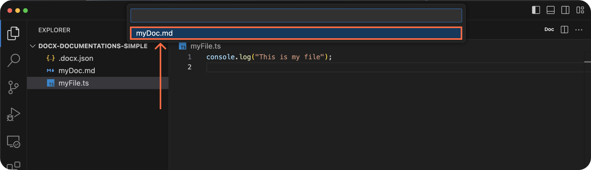
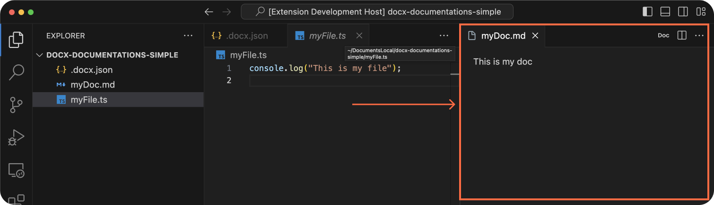

<p align="center">
  
</p>
<h1 align="center">DOCX</h1>

<p align="center">Visual Studio Code extension that facilitate access to your documentations</p>

<div align="center">
  <a href="https://marketplace.visualstudio.com/items?itemName=docx-mt5.docx">
    
  </a>
</div>

<br />

<p align="center">
  <a href="#demo">Demo</a> •
  <a href="#installation">Installation</a> •
  <a href="#configuration-manual">Configuration</a> •
  <a href="#how-to-add-your-access-token">Access token</a> •
  <a href="#usage">Usage</a> •
  <a href="#features">Features</a> •
  <a href="#other">Other</a>
</p>

<hr />
<br />

## Demo


## Installation

Visit the extension's page on the [Visual Studio Code Marketplace](https://marketplace.visualstudio.com/items?itemName=docx-mt5.docx).

## Configuration (manual)

Create a `.docx.json` file at the root of the project.

```json
{
  "ignorePatterns": ["node_modules", ".git", "dist"],
  "associations": {
    "file/or/folder": ["path/to/your/documentation.md"],
    "file/or/folder/2": [
        "path/to/your/documentation.md"
        "github/or/gitlab/url/to/your/documentation.md",
    ]
  }
}
```

Examples:<br />
[Local documentations](examples/local-documentations/)<br />
[Github documentations](examples/github-documentations/)<br />
[Gitlab documentations](examples/gitlab-documentations/)<br />
[Website documentations](examples/website-documentations/)<br />

## Configuration (automatic)

Generate your `.docx.json` automatically based on the project.

- Open the [command palette](https://docs.github.com/en/codespaces/codespaces-reference/using-the-vs-code-command-palette-in-codespaces#accessing-the-vs-code-command-palette) in Visual Studio Code:<br>
  <kbd>Ctrl</kbd>+<kbd>Shift</kbd>+<kbd>P</kbd> (Windows/Linux) or
  <kbd>Command</kbd>+<kbd>Shift</kbd>+<kbd>P</kbd> (Mac)


Remove unused associations :

- Open the [command palette](https://docs.github.com/en/codespaces/codespaces-reference/using-the-vs-code-command-palette-in-codespaces#accessing-the-vs-code-command-palette) in Visual Studio Code:<br>
  <kbd>Ctrl</kbd>+<kbd>Shift</kbd>+<kbd>P</kbd> (Windows/Linux) or
  <kbd>Command</kbd>+<kbd>Shift</kbd>+<kbd>P</kbd> (Mac)


## How to add your access token

Access tokens are indispensable for private repositories. <br/>
We highly suggest adding your access token if you use public repositories to avoid API restrictions :

| Provider | Without token    | With token        |
| -------- | ---------------- | ----------------- |
| Github   | 50 requests/h    | 5000 requests/h   |
| Gitlab   | 500 requests/min | 1500 requests/min |

<br/>

**Step 1**: Create your access token by visiting the following links: [Github](https://docs.github.com/en/authentication/keeping-your-account-and-data-secure/managing-your-personal-access-tokens#creating-a-fine-grained-personal-access-token), [Gitlab](https://docs.gitlab.com/ee/user/profile/personal_access_tokens.html#create-a-personal-access-token)

**Step 2**: Open the [command palette](https://docs.github.com/en/codespaces/codespaces-reference/using-the-vs-code-command-palette-in-codespaces#accessing-the-vs-code-command-palette) in Visual Studio Code:<br>
<kbd>Ctrl</kbd>+<kbd>Shift</kbd>+<kbd>P</kbd> (Windows/Linux) or <kbd>Command</kbd>+<kbd>Shift</kbd>+<kbd>P</kbd> (Mac)

**Step 3**: Type the appropriate command based on your provider:


## Usage

1. Example project architecture:

   ```
     .
     ├── .docx.json
     ├── myFile.ts
     └── myDoc.md
   ```

   `.docx.json`:

   ```json
   {
     "associations": {
       "myFile.ts": ["myDoc.md"]
     }
   }
   ```

2. Open a file linked to a documentation, e.g., "myFile.ts." and click on the button "doc" in the top right corner of the screen.
   
3. Choose the documentation you're interested in from the list.
   
4. Enjoy your documentation.
   

## Features

- [x] Ability to link a file or folder to one or multiple documentations.
- [x] Support for local documentation.
- [x] Support for documentation in a public or private repository ([access token needed](#how-to-add-your-access-token))
- [x] Support for documentation as website.
- [ ] Support workspace

## License

Distributed under the MIT License. See `LICENSE` for more information.

## Other

Note: The extension will add the following configuration to your Visual Studio Code user `settings.json`:

```json
"json.schemas": [
    {
        "fileMatch": [
            "/.docx.json"
        ],
        "url": "https://raw.githubusercontent.com/Mehdi-Verfaillie/docx/main/src/config/.docx.schema.json"
    }
]
```

This configuration ensures that Visual Studio Code recognizes the `.docx.json` file format and provides schema support.
